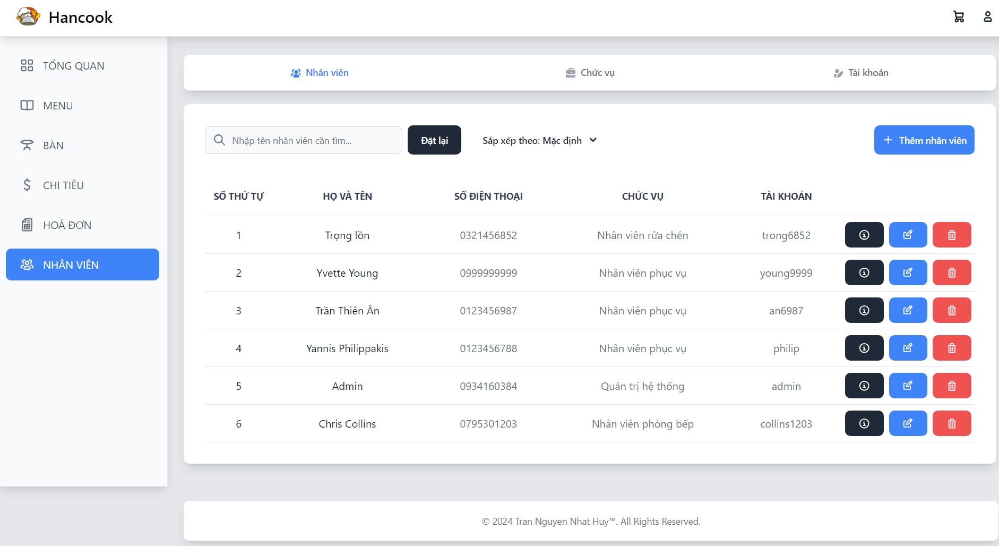
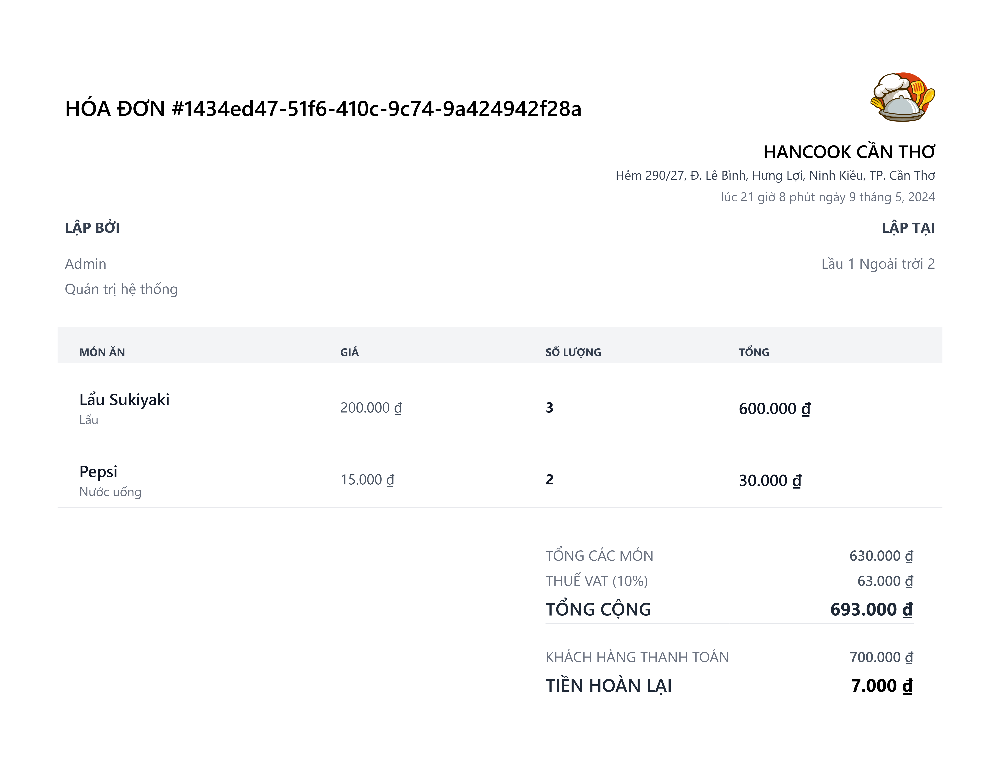
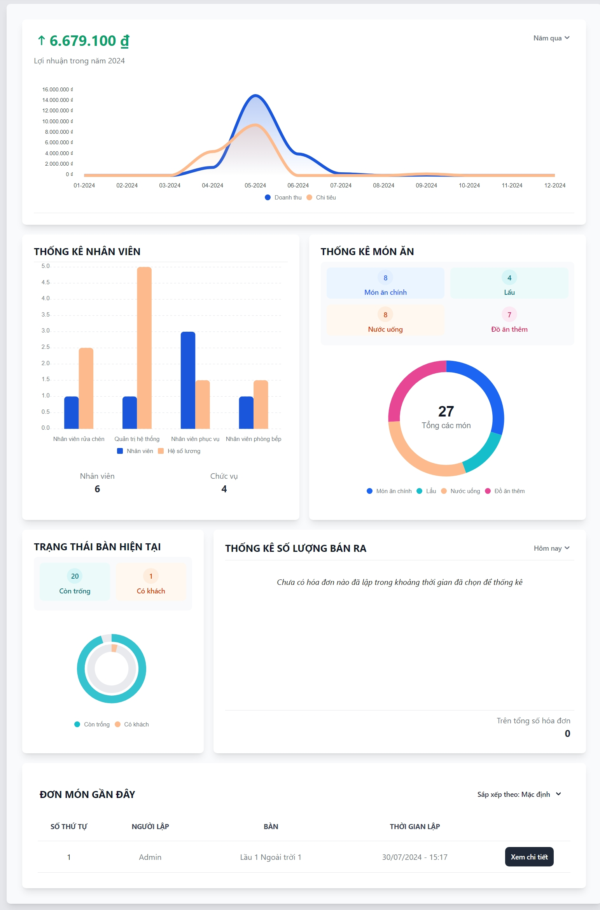
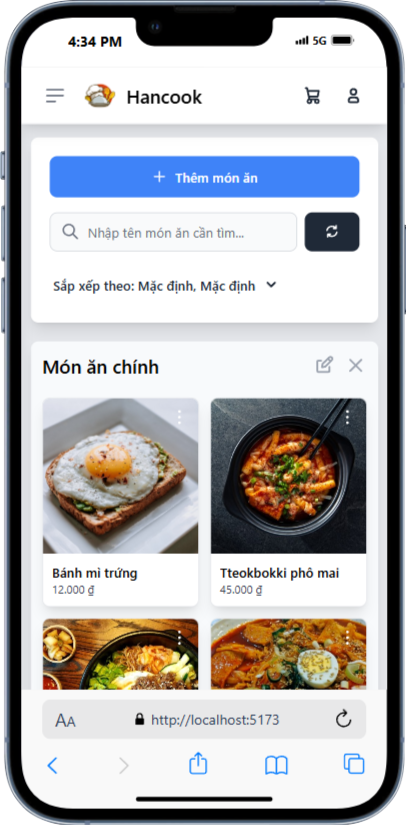
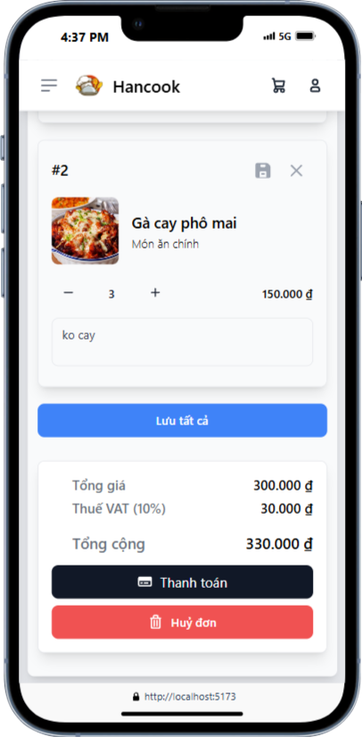
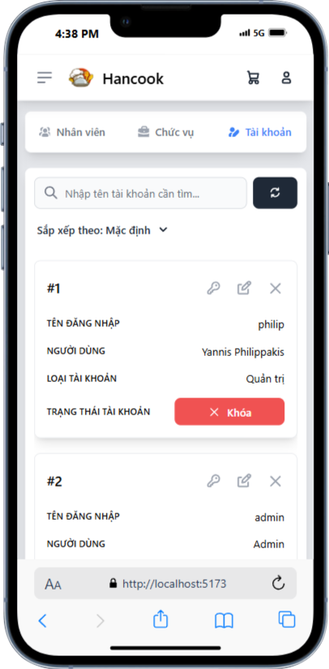

# Hancook (Client)

This repository contains the front-end application for a Korean-based restaurant management system. It is built using Vue 3, Vite, and other modern web development tools.

Check out [Hancook (Server)](https://github.com/bp82125/hancook-server)

## Tech Stack
- Frontend: Vue 3, Vite
- Styling: TailwindCSS, Flowbite
- State Management: Pinia
- Routing: Vue Router
- Charts: ApexCharts, Vue3-ApexCharts
- Storage: Firebase Authentication, Firestore, Firebase Storage
- Other Libraries: Axios, Fuse.js, html2canvas, vue-toastification, vue-cookies, vue-select

## Example Screenshots
### Desktop View
<br/>
<br/>
<br/>
### Mobile View
<p align="center">
  
</p>
<p align="center">
  
</p>
<p align="center">
  
</p>


## Getting Started

### Prerequisites
- Node.js (>= 20.18)
- npm or yarn

### Clone the repository
```bash
git clone https://github.com/your-username/hancook-client.git
cd hancook-client
```

### Install dependencies
Run the following command to install all the necessary dependencies:
```bash
npm install
```
Or 
```bash
yarn install
```

### Setting up the environment variables

1. Rename .env.example to .env
2. Open the .env file and replace the placeholders with your configuration values.

Example .env file:
```env
VITE_API_SERVER_URL=http://localhost:8080/api/v1
VITE_FIREBASE_API_KEY=AIzaSyD-Your-API-Key-Here
VITE_FIREBASE_AUTH_DOMAIN=your-project-id.firebaseapp.com
VITE_FIREBASE_PROJECT_ID=your-project-id
VITE_FIREBASE_STORAGE_BUCKET=your-project-id.appspot.com
VITE_FIREBASE_MESSAGING_SENDER_ID=1234567890
VITE_FIREBASE_APP_ID=1:1234567890:web:abcdefg12345678
VITE_FIREBASE_MEASUREMENT_ID=G-XXXXXXX
```

### Run the development server
Start the Vite development server:
```bash
npm run dev
```
Or
```bash
yarn dev
```
This will start the project locally on http://localhost:3000.

### Build for production
Once you're ready to deploy, build the project:
```bash
npm run build
```
Or
```bash
yarn build
```
To preview the production build locally, run:
```bash
npm run preview
```
Or
```bash
yarn preview
```

## License
This project is licensed under the MIT License - see the [LICENSE](LICENSE) file for details.
